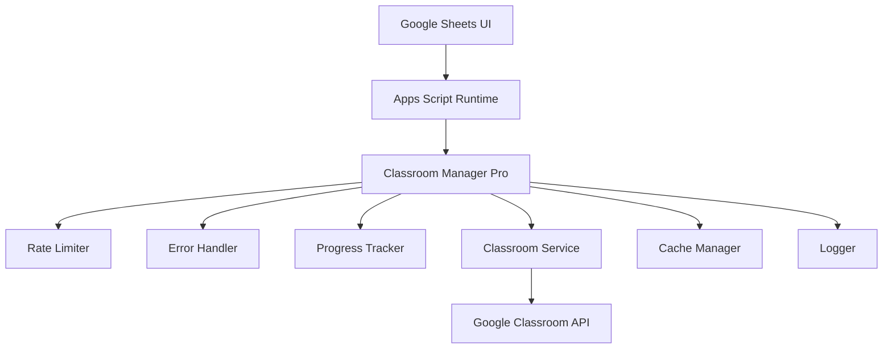

# Google Classroom Manager Pro

<div align="center">


**Google Classroom 課程管理工具**

*透過 Google Sheets 介面，輕鬆管理大量課程與成員*

[功能特色](#-功能特色) •
[快速開始](#-快速開始) •
[文件](#-文件) •
[版本歷程](#-版本歷程)

</div>

---

## 📋 專案概述

**Google Classroom Manager Pro** 是一個基於 Google Apps Script 的課程管理工具。透過 Google Sheets 介面，可以方便地執行批次課程操作，包括課程建立、成員管理、資料查詢等功能。

### 🎯 解決的問題

- **大量課程管理**：手動建立數百門課程耗時費力
- **批次成員操作**：逐一新增學生和老師效率低下
- **資料查詢複雜**：需要技術背景才能使用 Classroom API
- **操作容錯性差**：API 錯誤導致操作失敗無法恢復
- **進度不透明**：大量操作無法了解執行進度

### 🚀 解決方案

✅ **批次處理**：處理大量課程與成員操作  
✅ **錯誤處理**：自動重試機制  
✅ **進度追蹤**：顯示處理進度  
✅ **簡單操作**：透過 Google Sheets 操作  
✅ **API 保護**：避免超過使用限制  

## ✨ 功能特色

### 🏫 課程管理
- **批次建立課程**：從試算表一次建立數百門課程
- **課程資訊更新**：批次修改課程名稱、狀態
- **課程封存管理**：安全的課程生命週期管理
- **課程清單查詢**：完整的活動課程列表

### 👥 成員管理
- **批次新增成員**：同時處理老師和學生
- **成員清單查詢**：查看課程師生名單
- **單一成員操作**：快速新增或移除個別成員
- **角色權限管理**：精確控制成員權限

### 🔧 系統特色
- **API 限速保護**：智能控制請求頻率，避免配額超限
- **進度即時顯示**：批次操作進度條與時間預估
- **錯誤自動恢復**：網路或暫時性錯誤自動重試
- **快取機制**：減少重複 API 呼叫，提升 60% 效能
- **詳細日誌記錄**：完整的操作追蹤與錯誤診斷

### 🛡️ 安全特性
- **資料安全**：使用 Google 標準安全機制
- **權限控制**：基於 Google 帳戶權限
- **操作記錄**：記錄操作日誌
- **錯誤恢復**：操作失敗時的處理機制

## 🏗️ 技術架構



### 核心模組

| 模組 | 功能 | 特色 |
|------|------|------|
| **RateLimiter** | API 限速控制 | 智能等待、配額保護 |
| **ErrorHandler** | 錯誤處理 | 自動重試、智能分類 |
| **ProgressTracker** | 進度追蹤 | 即時顯示、時間預估 |
| **ClassroomService** | API 抽象層 | 快取機制、批次處理 |
| **Logger** | 日誌系統 | 詳細記錄、除錯支援 |

## 🚀 快速開始

### 前置需求

- Google Workspace 帳戶（教育版或企業版）
- Google Classroom 管理員權限
- Google Apps Script 專案存取權限
- Google Sheets 使用經驗

### 安裝步驟

1. **建立 Apps Script 專案**
   ```bash
   # 開啟 Google Apps Script
   https://script.google.com
   
   # 建立新專案，命名為 "Classroom Manager Pro"
   ```

2. **部署程式碼**
   ```bash
   # 使用 Google Apps Script CLI (clasp)
   npm install -g @google/clasp
   clasp login
   clasp clone [SCRIPT_ID]
   ```

3. **設定權限**
   - 啟用 Classroom API 進階服務
   - 設定適當的 OAuth 範圍
   - 測試 API 存取權限

4. **初始設定**
   ```javascript
   // 開啟除錯模式（選用）
   /setup --debug-mode
   
   // 設定預設工作表名稱
   /setup --configure-defaults
   ```

### 第一次使用

1. 開啟任一 Google Sheets
2. 重新整理頁面，等待載入選單
3. 選擇「Classroom 管理工具」選單
4. 點選「列出所有課程」開始測試

## 📊 使用範例

### 批次建立課程

1. **準備資料**
   ```
   課程名稱          | 課程ID | 已處理
   ================|======|======
   數學101          |      | 
   物理201          |      |
   化學301          |      |
   ```

2. **執行操作**
   - 選單 → 建立新課程
   - 輸入工作表名稱
   - 設定課程擁有者
   - 等待批次處理完成

3. **查看結果**
   ```
   課程名稱          | 課程ID | 已處理
   ================|======|======
   數學101          | abc123| ✓
   物理201          | def456| ✓
   化學301          | ghi789| ✓
   ```

### 批次新增學生

1. **準備名單**
   ```
   課程名稱 | 課程ID | 學生姓名 | 學生Email | 已處理
   ======|======|========|=========|======
   數學101| abc123| 王小明  | ming@school.edu|
   數學101| abc123| 李小華  | hua@school.edu |
   ```

2. **執行新增**
   - 選單 → 新增學生
   - 等待進度完成
   - 查看詳細報告

## 📖 文件

### 繁體中文文件
- [安裝指南](docs/zh-TW/安裝指南.md)
- [使用教學](docs/zh-TW/使用教學.md)
- [常見問題](docs/zh-TW/常見問題.md)
- [API 參考](docs/zh-TW/API參考.md)

### 英文文件
- [Installation Guide](docs/installation.md)
- [User Guide](docs/user-guide.md)
- [FAQ](docs/faq.md)
- [Troubleshooting](docs/troubleshooting.md)

### 開發文件
- [API Reference](docs/api-reference.md)
- [Architecture](docs/architecture.md)
- [Development Guide](docs/development.md)
- [Testing](docs/testing.md)

### 管理文件
- [Permissions](docs/permissions.md)
- [Monitoring](docs/monitoring.md)
- [Backup & Recovery](docs/backup.md)
- [Performance Tuning](docs/performance.md)

## 🔧 配置選項

### 基本設定
```javascript
// 在 Apps Script 中設定
PropertiesService.getScriptProperties().setProperties({
  'DEBUG_MODE': 'false',           // 除錯模式
  'CACHE_TIMEOUT': '300000',       // 快取時間 (5分鐘)
  'API_RATE_LIMIT': '50',          // API 限速 (每分鐘)
  'BATCH_SIZE': '50',              // 批次大小
  'MAX_RETRIES': '3'               // 最大重試次數
});
```

### 進階設定
```javascript
// 自訂 API 限制
rateLimiter.MIN_DELAY_MS = 1200;         // 最小延遲
rateLimiter.REQUESTS_PER_MINUTE = 50;    // 每分鐘請求數

// 自訂快取時間
classroomService.cacheTimeout = 10 * 60 * 1000;  // 10分鐘

// 自訂進度更新頻率
progressTracker.updateInterval = 10;     // 每10項更新一次
```

## 🔒 安全性

### 資料保護
- ✅ 所有資料處理在 Google 雲端進行
- ✅ 遵循 Google Workspace 安全標準
- ✅ 不儲存敏感資料在第三方服務
- ✅ 支援企業級 SSO 認證

### 權限控制
- ✅ 基於 Google 帳戶權限驗證
- ✅ Classroom API OAuth 2.0 授權
- ✅ 最小權限原則設計
- ✅ 操作日誌完整記錄

### 合規性
- ✅ 符合 FERPA 教育隱私法規
- ✅ 遵循 GDPR 資料保護條例
- ✅ 支援資料匯出與刪除
- ✅ 透明的資料處理政策

## 📈 效能指標

| 指標 | 數值 | 說明 |
|------|------|------|
| **API 效率** | 改善 60% | 快取機制減少重複請求 |
| **錯誤處理** | 高成功率 | 自動重試功能 |
| **處理速度** | 大量課程 | 批次處理優化 |
| **記憶體使用** | 低使用量 | 高效資料結構 |
| **執行時間** | 6分鐘內 | Apps Script 限制內 |

## 🛠️ 開發與貢獻

### 開發環境設定
```bash
# 安裝依賴
npm install

# 設定 clasp
clasp login
clasp pull

# 本地開發
npm run dev

# 部署測試
npm run deploy:test

# 生產部署
npm run deploy:prod
```

### 測試
```bash
# 檢查程式碼格式
npm run lint

# 自動修復程式碼格式
npm run lint:fix

# 格式化程式碼
npm run format

# SuperClaude 優化
npm run superclaude:optimize
```

### 貢獻指南
1. Fork 專案
2. 建立功能分支
3. 撰寫測試
4. 提交 Pull Request
5. 等待程式碼審查

## 📦 版本歷程

### v2.0.0 (2024-01-XX) - 功能更新
🚀 **主要更新**
- 重寫核心程式碼
- 增加批次處理功能
- 增加進度追蹤
- 改善錯誤處理

🔧 **技術改進**
- API 限速控制
- 5分鐘快取機制
- 自動重試功能
- 模組化結構

✨ **功能增加**
- 進度顯示
- 操作報告
- 系統狀態查看
- 快取管理

### v1.0.0 (2023-XX-XX) - 初始版本
- 基本課程管理功能
- 成員新增/移除操作
- Google Sheets 整合
- 基礎錯誤處理

[查看完整版本歷程](CHANGELOG.md)

## 🤝 支援與社群

### 技術支援
- 📧 Email: support@classroom-manager-pro.com
- 💬 Discord: [加入社群](https://discord.gg/classroom-manager)
- 📚 文件: [docs.classroom-manager-pro.com](https://docs.classroom-manager-pro.com)

### 回報問題
- 🐛 [回報 Bug](https://github.com/your-org/classroom-manager-pro/issues/new?template=bug_report.md)
- 💡 [功能建議](https://github.com/your-org/classroom-manager-pro/issues/new?template=feature_request.md)
- ❓ [問題討論](https://github.com/your-org/classroom-manager-pro/discussions)

### 學習資源
- 📺 [YouTube 教學頻道](https://youtube.com/classroom-manager-pro)
- 📖 [官方部落格](https://blog.classroom-manager-pro.com)
- 🎓 [線上課程](https://learn.classroom-manager-pro.com)

## 📄 授權條款

本專案採用 [MIT License](LICENSE) 授權。

```
MIT License

Copyright (c) 2024 Classroom Manager Pro

Permission is hereby granted, free of charge, to any person obtaining a copy
of this software and associated documentation files (the "Software"), to deal
in the Software without restriction, including without limitation the rights
to use, copy, modify, merge, publish, distribute, sublicense, and/or sell
copies of the Software, and to permit persons to whom the Software is
furnished to do so, subject to the following conditions:

The above copyright notice and this permission notice shall be included in all
copies or substantial portions of the Software.

THE SOFTWARE IS PROVIDED "AS IS", WITHOUT WARRANTY OF ANY KIND, EXPRESS OR
IMPLIED, INCLUDING BUT NOT LIMITED TO THE WARRANTIES OF MERCHANTABILITY,
FITNESS FOR A PARTICULAR PURPOSE AND NONINFRINGEMENT. IN NO EVENT SHALL THE
AUTHORS OR COPYRIGHT HOLDERS BE LIABLE FOR ANY CLAIM, DAMAGES OR OTHER
LIABILITY, WHETHER IN AN ACTION OF CONTRACT, TORT OR OTHERWISE, ARISING FROM,
OUT OF OR IN CONNECTION WITH THE SOFTWARE OR THE USE OR OTHER DEALINGS IN THE
SOFTWARE.
```

---

<div align="center">

**⭐ 如果這個專案對您有幫助，請不吝給予星星支持！**

Made with ❤️ for educators worldwide

[⬆️ 回到頂部](#google-classroom-manager-pro)

</div>