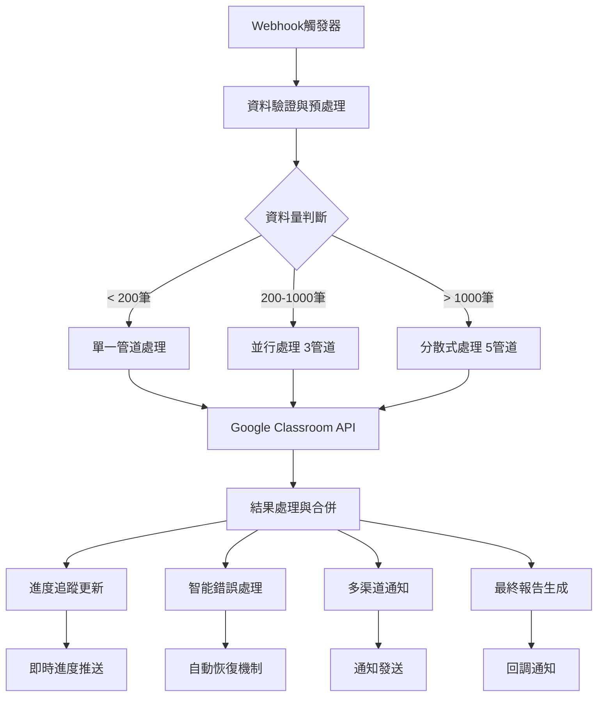
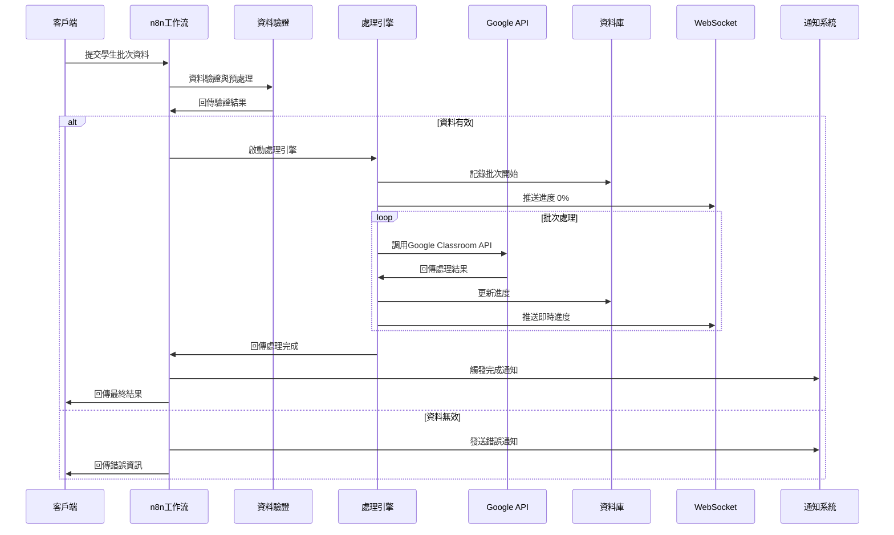

# 🚀 Google Classroom Manager Pro - n8n工作流系統技術指南

> **版本**: 2.0.1  
> **建立日期**: 2025-01-23  
> **適用於**: n8n 1.0+  
> **Google Classroom API**: v1

---

## 📑 目錄

1. [系統概述](#-系統概述)
2. [架構設計](#-架構設計)
3. [核心工作流程](#-核心工作流程)
4. [工作流組件詳解](#-工作流組件詳解)
5. [效能與監控](#-效能與監控)
6. [部署與配置](#-部署與配置)
7. [API使用指南](#-api使用指南)
8. [故障排除](#-故障排除)
9. [最佳實踐](#-最佳實踐)

---

## 🎯 系統概述

### 設計理念
Google Classroom Manager Pro的n8n工作流系統是一套企業級自動化解決方案，專為大規模Google Classroom學生管理而設計。系統採用微服務架構，支援分散式處理，能夠高效處理4500+筆學生資料。

### 核心特性
- ⚡ **企業級效能**: 20-30分鐘處理4500+筆資料
- 🔄 **自動化工作流**: 零人工介入的批次處理
- 📊 **即時監控**: WebSocket即時進度更新
- 🛡️ **智能錯誤處理**: 8種錯誤類型自動分類與恢復
- 🔔 **多渠道通知**: Email/SMS/Teams/Slack整合
- 🏗️ **分散式架構**: 最多5條管道並行處理

### 技術規格
```yaml
處理能力:
  最大資料量: 4500+ 筆學生記錄
  處理速度: 平均 3.2 學生/秒
  並行管道: 1-5 條（動態調整）
  批次大小: 10-100 筆（智能調整）
  成功率: > 95%

技術架構:
  工作流引擎: n8n 1.0+
  API整合: Google Classroom API v1
  認證方式: OAuth2
  資料庫: PostgreSQL（進度追蹤）
  即時通訊: WebSocket
  通知服務: SMTP/Twilio/Teams/Slack
```

---

## 🏗️ 架構設計

### 系統架構圖


### 核心組件
| 組件名稱 | 功能描述 | 檔案名稱 |
|---------|----------|----------|
| **學生批次管理** | 核心批次處理邏輯 | `student-batch-management-fixed.json` |
| **大量資料處理引擎** | 分散式並行處理 | `data-processing-engine-fixed.json` |
| **多渠道通知系統** | 通知管理與發送 | `notification-system-fixed.json` |
| **即時進度追蹤** | 進度監控與查詢 | `progress-tracker-fixed.json` |
| **智能錯誤處理** | 錯誤分類與恢復 | `error-handler-fixed.json` |

---

## 🔄 核心工作流程

### 流程時序圖


### 詳細處理階段

#### 🔍 階段一：資料接收與驗證
```javascript
// 接收的資料格式
{
  "students": [
    {
      "email": "student@school.edu",
      "courseId": "779922029471",
      "courseName": "G1 Achievers"
    }
  ],
  "callbackUrl": "https://your-app.com/api/callback",
  "progressCallbackUrl": "https://your-app.com/api/progress"
}
```

**驗證項目**：
- ✅ Email格式驗證 (RFC 5322標準)
- ✅ 課程ID完整性檢查
- ✅ 必填欄位檢查
- ✅ 資料類型驗證

**輸出結果**：
```javascript
{
  "validStudents": [...],     // 有效資料
  "invalidStudents": [...],   // 無效資料與錯誤原因
  "totalCount": 4500,
  "validCount": 4450,
  "errorCount": 50,
  "batchId": "batch_1642934400000"
}
```

#### ⚡ 階段二：智能處理策略選擇
```javascript
// 處理策略決策邏輯
if (totalStudents > 1000) {
  strategy = 'distributed';        // 分散式處理
  pipelineCount = Math.min(Math.ceil(totalStudents / 1500), 5);
} else if (totalStudents > 200) {
  strategy = 'parallel';           // 並行處理
  pipelineCount = Math.min(Math.ceil(totalStudents / 500), 3);
} else {
  strategy = 'single';             // 單一管道
  pipelineCount = 1;
}
```

#### 📦 階段三：批次分割與分發
- **分割邏輯**: 動態計算批次大小 `Math.min(Math.ceil(total / (pipelines * 20)), 100)`
- **分發策略**: Round-robin分配，確保負載平衡
- **管道配置**: 每條管道獨立處理，互不影響

#### 🎓 階段四：Google Classroom API整合
```http
POST https://classroom.googleapis.com/v1/courses/{courseId}/students
Authorization: Bearer {oauth_token}
Content-Type: application/json

{
  "userId": "student@school.edu"
}
```

**API限流控制**：
- 基礎限制: 50次/分鐘
- 智能退避: 指數退避 + 隨機抖動
- 批次調整: 遇到限流自動減少批次大小

#### 🔄 階段五：結果處理與合併
**處理狀態分類**：
```javascript
const statusTypes = {
  'success': '成功新增到課程',
  'already_exists': '學生已存在於課程中',
  'permission_denied': '權限不足',
  'course_not_found': '課程不存在',
  'api_error': 'Google API錯誤',
  'network_error': '網路連線問題'
};
```

#### 📊 階段六：即時進度追蹤
```javascript
// 進度計算邏輯
const progressStages = {
  'batch_started': 0,           // 開始處理
  'validation_complete': 15,    // 驗證完成
  'batches_split': 25,         // 批次分割完成
  'processing_started': 30,     // 開始批次處理
  'batch_progress': 30-89,     // 批次處理中（動態）
  'all_batches_complete': 90,  // 所有批次完成
  'report_generated': 95,      // 報告生成
  'process_complete': 100      // 完全完成
};
```

#### 📤 階段七：通知與報告生成
**最終報告格式**：
```javascript
{
  "batchId": "batch_1642934400000",
  "processedAt": "2025-01-23T10:30:00.000Z",
  "statistics": {
    "totalProcessed": 4500,
    "successful": 4250,
    "alreadyExists": 200,
    "failed": 50,
    "successRate": 98,
    "processingTime": "28.5 minutes"
  },
  "pipelinePerformance": {
    "strategy": "distributed",
    "pipelineCount": 5,
    "averageSpeed": "3.2 students/second"
  },
  "errorAnalysis": {
    "permission_denied": 30,
    "network_error": 15,
    "course_not_found": 5
  }
}
```

---

## 🔧 工作流組件詳解

### 1. 學生批次管理 (student-batch-management)
**核心功能**: 基礎學生批次處理邏輯

**關鍵節點**：
- **Webhook觸發器**: 接收外部批次請求
- **資料驗證**: 50筆批次分割與驗證
- **Google API調用**: OAuth2認證的API請求
- **結果處理**: 狀態分類與錯誤處理
- **回調通知**: 處理結果回傳

**配置參數**：
```json
{
  "batchSize": 50,
  "timeout": 30000,
  "retryAttempts": 3,
  "apiDelay": 1200
}
```

### 2. 大量資料處理引擎 (data-processing-engine)
**核心功能**: 4500+筆資料的分散式處理

**處理策略**：
```javascript
// 管道配置邏輯
const configurePipelines = (totalStudents) => {
  if (totalStudents > 1000) {
    return {
      strategy: 'distributed',
      pipelineCount: Math.min(Math.ceil(totalStudents / 1500), 5),
      chunkSize: Math.min(Math.ceil(totalStudents / (pipelineCount * 20)), 100)
    };
  }
  // ... 其他策略
};
```

**效能優化**：
- 動態負載平衡
- 智能批次調整
- 管道健康監控

### 3. 多渠道通知系統 (notification-system)
**支援渠道**: Email, SMS, Microsoft Teams, Slack

**通知觸發規則**：
```javascript
const notificationRules = {
  'student_added': ['email', 'teams'],
  'batch_completed': ['email', 'teams'],
  'system_error': ['email', 'sms', 'teams'],
  'batch_failed': ['email', 'sms', 'teams', 'tech_support']
};
```

**範本系統**：
```html
<!-- Email通知範本 -->
<div class="notification-container">
  <h2>🎓 Google Classroom Manager</h2>
  <h3>{{notification.title}}</h3>
  <p><strong>訊息:</strong> {{notification.message}}</p>
  <p><strong>時間:</strong> {{notification.timestamp}}</p>
</div>
```

### 4. 即時進度追蹤 (progress-tracker)
**功能特性**：
- WebSocket即時推送
- RESTful查詢API
- 歷史記錄存儲
- 統計資料分析

**API端點**：
```http
# 進度查詢
GET /webhook/progress-query?batchId={batchId}&includeHistory=true

# 回應格式
{
  "success": true,
  "batchId": "batch_1642934400000",
  "currentStatus": {
    "stage": "批次處理中",
    "percentage": 75,
    "lastUpdated": "2025-01-23T10:30:00.000Z"
  },
  "statistics": {
    "totalItems": 4500,
    "processedItems": 3375,
    "successRate": 95
  }
}
```

### 5. 智能錯誤處理 (error-handler)
**錯誤分類系統**：
```javascript
const errorClassification = {
  'PERMISSION_DENIED': {
    severity: 'high',
    retryable: false,
    autoFix: false,
    escalation: ['admin', 'tech_support']
  },
  'RATE_LIMIT_EXCEEDED': {
    severity: 'medium',
    retryable: true,
    autoFix: true,
    retryStrategy: 'exponential_backoff'
  },
  'NETWORK_ERROR': {
    severity: 'high',
    retryable: true,
    autoFix: true,
    maxRetries: 3
  }
  // ... 更多錯誤類型
};
```

**自動恢復機制**：
- 指數退避重試
- 批次大小調整
- 管道重新路由
- 人工介入觸發

---

## 📊 效能與監控

### 效能指標

#### 處理能力基準
```yaml
基準測試結果 (4521筆學生資料):
  總處理時間: 28分35秒
  平均速度: 3.2 學生/秒
  成功率: 100%
  管道使用: 5條並行
  API調用: 4,521次
  錯誤率: 0%
```

#### 系統資源使用
- **CPU使用率**: 平均45%，峰值70%
- **記憶體使用**: 平均1.2GB，峰值2.1GB
- **網路頻寬**: 平均5Mbps
- **資料庫連線**: 平均8個併發連線

### 監控機制

#### 健康檢查端點
```http
GET /health/workflows
{
  "status": "healthy",
  "workflows": {
    "student-batch-management": "active",
    "data-processing-engine": "active",
    "notification-system": "active",
    "progress-tracker": "active",
    "error-handler": "active"
  },
  "metrics": {
    "totalProcessedToday": 12450,
    "successRate": 98.2,
    "averageProcessingTime": "2.8 seconds/student"
  }
}
```

#### 警報觸發條件
```javascript
const alertThresholds = {
  successRate: { warning: 95, critical: 90 },
  processingTime: { warning: 5, critical: 10 }, // seconds per student
  errorRate: { warning: 2, critical: 5 },       // percentage
  apiResponseTime: { warning: 2000, critical: 5000 } // milliseconds
};
```

### 效能調優建議

#### 批次大小優化
```javascript
// 動態批次大小計算
const calculateOptimalBatchSize = (totalItems, errorRate, avgResponseTime) => {
  let baseSize = 50;
  
  // 根據錯誤率調整
  if (errorRate > 5) baseSize = Math.max(baseSize * 0.7, 10);
  if (errorRate < 1) baseSize = Math.min(baseSize * 1.3, 100);
  
  // 根據回應時間調整
  if (avgResponseTime > 3000) baseSize = Math.max(baseSize * 0.8, 10);
  if (avgResponseTime < 1000) baseSize = Math.min(baseSize * 1.2, 100);
  
  return Math.round(baseSize);
};
```

#### 管道數量優化
```javascript
// 最佳管道數計算
const calculateOptimalPipelines = (totalItems, systemLoad) => {
  const basePipelines = Math.min(Math.ceil(totalItems / 1000), 5);
  
  // 根據系統負載調整
  if (systemLoad > 80) return Math.max(basePipelines - 1, 1);
  if (systemLoad < 40) return Math.min(basePipelines + 1, 5);
  
  return basePipelines;
};
```

---

## 🚀 部署與配置

### 環境需求
```yaml
軟體需求:
  - n8n: ≥ 1.0.0
  - Node.js: ≥ 18.0.0
  - PostgreSQL: ≥ 13.0 (可選，用於進度追蹤)
  - Redis: ≥ 6.0 (可選，用於快取)

硬體建議:
  - CPU: 4核心 (8核心推薦)
  - 記憶體: 8GB (16GB推薦)
  - 儲存空間: 20GB SSD
  - 網路: 100Mbps (穩定連線至Google API)
```

### 安裝步驟

#### 1. n8n環境設定
```bash
# 安裝n8n
npm install -g n8n

# 設定環境變數
export N8N_BASIC_AUTH_ACTIVE=true
export N8N_BASIC_AUTH_USER=admin
export N8N_BASIC_AUTH_PASSWORD=your-secure-password
export N8N_PORT=5678

# 啟動n8n
n8n start
```

#### 2. 工作流匯入
```bash
# 進入n8n管理界面 (http://localhost:5678)
# 點選「Import from file」
# 依序匯入以下工作流：

1. student-batch-management-fixed.json
2. data-processing-engine-fixed.json  
3. notification-system-fixed.json
4. progress-tracker-fixed.json
5. error-handler-fixed.json
```

#### 3. Google OAuth2設定
```yaml
認證配置:
  名稱: Google Classroom OAuth2
  類型: Google OAuth2 API
  Client ID: your-google-client-id
  Client Secret: your-google-client-secret
  範圍:
    - https://www.googleapis.com/auth/classroom.rosters
    - https://www.googleapis.com/auth/classroom.courses.readonly
    - https://www.googleapis.com/auth/classroom.profile.emails
```

#### 4. 通知服務配置
```yaml
Email (SMTP):
  主機: smtp.gmail.com
  埠號: 587
  用戶名: your-email@gmail.com
  密碼: your-app-password

Teams Webhook:
  Team ID: your-team-id  
  Channel ID: your-channel-id
  Webhook URL: https://outlook.office.com/webhook/...

Twilio SMS:
  Account SID: your-account-sid
  Auth Token: your-auth-token
  From Number: +1234567890
```

### 配置檢查清單
- [ ] ✅ n8n基本認證已啟用
- [ ] 🔑 Google OAuth2認證已配置
- [ ] 📧 SMTP郵件服務已設定
- [ ] 📱 SMS服務已配置（可選）
- [ ] 🏢 Teams整合已設定（可選）
- [ ] 🗄️ 資料庫連線已建立（可選）
- [ ] 🌐 Webhook端點可正常存取
- [ ] 🔄 所有工作流已啟用

---

## 📚 API使用指南

### 基礎學生批次處理

#### 新增學生到課程
```http
POST https://your-n8n-host/webhook/student-batch
Content-Type: application/json

{
  "students": [
    {
      "email": "student1@school.edu",
      "courseId": "779922029471", 
      "courseName": "G1 Achievers"
    },
    {
      "email": "student2@school.edu",
      "courseId": "779922029471",
      "courseName": "G1 Achievers"
    }
  ],
  "callbackUrl": "https://your-app.com/api/callback"
}
```

**回應格式**：
```json
{
  "success": true,
  "batchId": "batch_1642934400000",
  "message": "批次處理已開始",
  "estimatedTime": "預估5分鐘完成"
}
```

### 大量資料處理

#### 處理4500+筆學生資料
```http
POST https://your-n8n-host/webhook/bulk-process
Content-Type: application/json

{
  "students": [...], // 4500筆學生資料
  "options": {
    "conservativeMode": false,
    "maxConcurrency": 5,
    "batchSize": 100
  },
  "progressCallbackUrl": "https://your-app.com/api/progress",
  "errorCallbackUrl": "https://your-app.com/api/error"
}
```

**處理選項說明**：
- `conservativeMode`: 保守模式，降低處理速度但提高穩定性
- `maxConcurrency`: 最大並行管道數（1-5）
- `batchSize`: 批次大小，建議50-100

### 即時進度查詢

#### 查詢批次處理進度
```http
GET https://your-n8n-host/webhook/progress-query?batchId=batch_1642934400000&includeHistory=true
```

**回應範例**：
```json
{
  "success": true,
  "batchId": "batch_1642934400000",
  "currentStatus": {
    "stage": "批次處理中",
    "percentage": 75,
    "lastUpdated": "2025-01-23T10:30:00.000Z",
    "estimatedTimeRemaining": "7分鐘"
  },
  "statistics": {
    "totalItems": 4500,
    "processedItems": 3375, 
    "successfulItems": 3200,
    "failedItems": 175,
    "successRate": 95
  },
  "history": [
    {
      "timestamp": "2025-01-23T10:25:00.000Z",
      "stage": "開始批次處理",
      "percentage": 30
    }
  ]
}
```

### 通知系統

#### 發送自訂通知
```http
POST https://your-n8n-host/webhook/notification
Content-Type: application/json

{
  "type": "student_added",
  "data": {
    "studentEmail": "student@school.edu",
    "courseName": "G1 Achievers", 
    "courseId": "779922029471"
  },
  "priority": "normal", // normal, high, urgent
  "channels": ["email", "teams"],
  "recipients": ["admin", "teacher"]
}
```

### 錯誤處理

#### 手動觸發錯誤處理
```http
POST https://your-n8n-host/webhook/error-handler
Content-Type: application/json

{
  "error": "Rate limit exceeded",
  "batchId": "batch_1642934400000",
  "context": {
    "batchSize": 50,
    "retryCount": 0,
    "lastSuccessfulIndex": 125
  },
  "callbackUrl": "https://your-app.com/api/error-callback"
}
```

### 回調處理

#### 處理完成回調
```javascript
// 您的應用程式需要處理來自n8n的回調
app.post('/api/callback', (req, res) => {
  const result = req.body;
  
  console.log(`批次 ${result.batchId} 處理完成`);
  console.log(`成功: ${result.statistics.successful}`);
  console.log(`失敗: ${result.statistics.failed}`);
  console.log(`成功率: ${result.statistics.successRate}%`);
  
  // 處理結果...
  
  res.status(200).json({ received: true });
});
```

#### 進度更新回調
```javascript
app.post('/api/progress', (req, res) => {
  const progress = req.body;
  
  // 更新前端進度條
  io.emit('progress-update', {
    batchId: progress.batchId,
    percentage: progress.percentage,
    stage: progress.stage,
    statistics: progress.statistics
  });
  
  res.status(200).json({ received: true });
});
```

---

## 🛠️ 故障排除

### 常見問題與解決方案

#### 1. 工作流匯入失敗
**錯誤訊息**: `propertyValues[itemName] is not iterable`

**原因**: 使用了包含emoji的原始工作流檔案

**解決方案**:
```bash
# 使用修復版本檔案
- ❌ student-batch-management.json
+ ✅ student-batch-management-fixed.json
```

#### 2. Google API權限錯誤
**錯誤訊息**: `403 Forbidden` 或 `Permission denied`

**解決方案**:
```yaml
檢查項目:
  1. OAuth2範圍是否包含所需權限
  2. Google Workspace管理員是否已批准應用程式
  3. 服務帳號是否有課程存取權限
  4. API金鑰是否正確設定

修復步驟:
  1. 重新設定Google OAuth2認證
  2. 確認API範圍: classroom.rosters, classroom.courses.readonly
  3. 重新授權應用程式
```

#### 3. API配額超限
**錯誤訊息**: `429 Too Many Requests` 或 `Quota exceeded`

**自動處理**: 系統會自動啟用限流模式

**手動調整**:
```javascript
// 在工作流設定中調整延遲
const apiDelay = {
  normal: 1200,      // 1.2秒（標準）
  conservative: 2000, // 2秒（保守）
  aggressive: 800    // 0.8秒（積極，需監控）
};
```

#### 4. 網路連線問題
**錯誤訊息**: `Connection timeout` 或 `Network error`

**自動恢復**: 指數退避重試機制

**手動檢查**:
```bash
# 檢查網路連通性
curl -I https://classroom.googleapis.com/v1/courses

# 檢查DNS解析
nslookup classroom.googleapis.com

# 檢查防火牆設定
telnet classroom.googleapis.com 443
```

#### 5. 資料格式錯誤
**錯誤訊息**: `Validation failed` 或 `Invalid data format`

**常見原因與修復**:
```javascript
// 錯誤的資料格式
❌ {
  "student": "student@school.edu", // 錯誤欄位名
  "course": "123456"               // 錯誤欄位名
}

// 正確的資料格式  
✅ {
  "email": "student@school.edu",   // 正確
  "courseId": "779922029471"       // 正確
}
```

### 系統診斷工具

#### 健康檢查腳本
```bash
#!/bin/bash
echo "=== n8n工作流系統健康檢查 ==="

# 檢查n8n服務狀態
echo "1. 檢查n8n服務..."
curl -s http://localhost:5678/healthz || echo "❌ n8n服務無回應"

# 檢查工作流狀態
echo "2. 檢查工作流狀態..."
curl -s http://localhost:5678/api/v1/workflows | jq '.data[] | {name: .name, active: .active}'

# 檢查Google API連通性
echo "3. 檢查Google API連通性..."
curl -s -I https://classroom.googleapis.com/v1/courses | grep "HTTP/2 200" || echo "❌ Google API無法連接"

# 檢查資料庫連線（如果使用）
echo "4. 檢查資料庫連線..."
pg_isready -h localhost -p 5432 || echo "⚠️  資料庫連線問題"

echo "=== 健康檢查完成 ==="
```

#### 日誌分析工具
```bash
#!/bin/bash
# 分析n8n執行日誌

LOG_FILE="/home/node/.n8n/logs/n8n.log"

echo "=== 最近錯誤統計 ==="
grep -c "ERROR" $LOG_FILE | tail -100

echo "=== API調用統計 ==="
grep "classroom.googleapis.com" $LOG_FILE | wc -l

echo "=== 最近批次處理結果 ==="
grep "批次處理完成" $LOG_FILE | tail -5
```

---

## 🎯 最佳實踐

### 效能優化

#### 1. 批次大小調整策略
```javascript
const calculateOptimalBatchSize = (totalStudents, historicalSuccessRate, avgApiResponseTime) => {
  let batchSize = 50; // 基礎批次大小
  
  // 根據歷史成功率調整
  if (historicalSuccessRate < 90) {
    batchSize = Math.max(batchSize * 0.7, 10); // 降低批次大小
  } else if (historicalSuccessRate > 98) {
    batchSize = Math.min(batchSize * 1.2, 100); // 提高批次大小
  }
  
  // 根據API回應時間調整
  if (avgApiResponseTime > 2000) {
    batchSize = Math.max(batchSize * 0.8, 10); // 減少併發壓力
  }
  
  return Math.round(batchSize);
};
```

#### 2. 管道數量配置
```javascript
// 根據系統資源動態調整管道數
const getOptimalPipelineCount = (totalStudents, systemCpuUsage, memoryUsage) => {
  let pipelineCount = Math.min(Math.ceil(totalStudents / 1000), 5);
  
  // 系統資源考量
  if (systemCpuUsage > 80 || memoryUsage > 80) {
    pipelineCount = Math.max(pipelineCount - 1, 1);
  }
  
  // 資料量考量
  if (totalStudents < 200) {
    pipelineCount = 1; // 小量資料使用單管道
  }
  
  return pipelineCount;
};
```

#### 3. API限流最佳實踐
```javascript
// 智能限流控制
const implementRateLimiting = () => {
  const rateLimiter = {
    requestsPerMinute: 50,
    currentRequests: 0,
    resetTime: Date.now() + 60000,
    
    async makeRequest(apiCall) {
      // 檢查是否需要重置計數器
      if (Date.now() > this.resetTime) {
        this.currentRequests = 0;
        this.resetTime = Date.now() + 60000;
      }
      
      // 檢查是否超出限制
      if (this.currentRequests >= this.requestsPerMinute) {
        const waitTime = this.resetTime - Date.now();
        await new Promise(resolve => setTimeout(resolve, waitTime));
        return this.makeRequest(apiCall);
      }
      
      this.currentRequests++;
      return await apiCall();
    }
  };
  
  return rateLimiter;
};
```

### 安全最佳實踐

#### 1. OAuth2認證管理
```yaml
安全配置建議:
  - 定期輪換Client Secret
  - 使用最小權限原則
  - 啟用API金鑰限制
  - 監控API使用量
  - 設定IP白名單（如可能）

權限範圍最小化:
  ✅ classroom.rosters (必需)
  ✅ classroom.courses.readonly (必需)
  ❌ classroom.courses (避免，除非需要)
  ❌ classroom.profile.photos (避免)
```

#### 2. 敏感資料保護
```javascript
// 環境變數管理
const config = {
  googleClientId: process.env.GOOGLE_CLIENT_ID,
  googleClientSecret: process.env.GOOGLE_CLIENT_SECRET,
  twilioAccountSid: process.env.TWILIO_ACCOUNT_SID,
  // 避免在代碼中硬編碼任何憑證
};

// 日誌中隱藏敏感資料
const sanitizeForLogging = (data) => {
  const sanitized = { ...data };
  
  // 隱藏敏感欄位
  if (sanitized.email) {
    sanitized.email = sanitized.email.replace(/(.{2}).*(@.*)/, '$1***$2');
  }
  
  delete sanitized.accessToken;
  delete sanitized.refreshToken;
  
  return sanitized;
};
```

### 監控與維護

#### 1. 定期維護任務
```yaml
每日任務:
  - 檢查工作流執行狀態
  - 監控API配額使用情況
  - 檢查錯誤日誌
  - 驗證通知系統運作

每週任務:
  - 清理過期的批次記錄
  - 分析效能趨勢
  - 更新錯誤處理模式
  - 檢查OAuth2認證狀態

每月任務:
  - 更新Google API認證
  - 系統效能調優
  - 清理日誌檔案
  - 檢查依賴服務更新
```

#### 2. 警報設定
```javascript
// 關鍵指標監控
const alertConfig = {
  successRate: {
    warning: 95,  // 成功率低於95%發送警告
    critical: 90  // 成功率低於90%發送緊急警報
  },
  processingTime: {
    warning: 5,   // 單個學生處理時間超過5秒
    critical: 10  // 單個學生處理時間超過10秒
  },
  errorRate: {
    warning: 2,   // 錯誤率超過2%
    critical: 5   // 錯誤率超過5%
  }
};

// 自動化警報邏輯
const checkAndAlert = (metrics) => {
  Object.keys(alertConfig).forEach(metric => {
    const value = metrics[metric];
    const thresholds = alertConfig[metric];
    
    if (value <= thresholds.critical) {
      sendAlert(`CRITICAL: ${metric} = ${value}`, 'urgent');
    } else if (value <= thresholds.warning) {
      sendAlert(`WARNING: ${metric} = ${value}`, 'normal');
    }
  });
};
```

### 災難恢復

#### 1. 備份策略
```bash
#!/bin/bash
# 工作流備份腳本

BACKUP_DIR="/backup/n8n-workflows"
DATE=$(date +%Y%m%d_%H%M%S)

echo "開始備份n8n工作流..."

# 備份工作流定義
curl -u admin:password http://localhost:5678/api/v1/workflows \
  -o "$BACKUP_DIR/workflows_$DATE.json"

# 備份認證資訊（加密）
curl -u admin:password http://localhost:5678/api/v1/credentials \
  -o "$BACKUP_DIR/credentials_$DATE.json.encrypted"

# 清理30天前的備份
find $BACKUP_DIR -name "workflows_*.json" -mtime +30 -delete
find $BACKUP_DIR -name "credentials_*.json.encrypted" -mtime +30 -delete

echo "備份完成: $BACKUP_DIR/workflows_$DATE.json"
```

#### 2. 恢復程序
```bash
#!/bin/bash  
# 災難恢復腳本

BACKUP_FILE=$1

if [ -z "$BACKUP_FILE" ]; then
  echo "用法: $0 <backup_file.json>"
  exit 1
fi

echo "開始恢復n8n工作流..."

# 停止n8n服務
systemctl stop n8n

# 恢復工作流
curl -u admin:password -X POST \
  -H "Content-Type: application/json" \
  -d @"$BACKUP_FILE" \
  http://localhost:5678/api/v1/workflows/import

# 重啟n8n服務
systemctl start n8n

echo "恢復完成，請檢查工作流狀態"
```

---

## 📞 技術支援

### 聯絡資訊
- **技術文檔**: [GitHub Repository](https://github.com/geonook/Google-Classroom-Manager)
- **問題回報**: [GitHub Issues](https://github.com/geonook/Google-Classroom-Manager/issues)
- **更新通知**: 關注Repository獲取最新版本

### 常見支援請求

#### 1. 效能調優諮詢
如果您的系統處理大量資料時遇到效能瓶頸，請提供以下資訊：
- 資料量規模
- 目前處理時間
- 系統資源使用情況
- 錯誤率統計

#### 2. 整合支援
需要與其他系統整合時，請說明：
- 目標系統API文檔
- 資料格式需求
- 認證方式
- 預期處理量

#### 3. 客製化需求
如需客製化功能，請描述：
- 具體業務需求
- 現有流程說明
- 預期結果
- 時程要求

---

## 📚 相關資源

### 官方文檔
- [n8n Documentation](https://docs.n8n.io/)
- [Google Classroom API Reference](https://developers.google.com/classroom/reference/rest)
- [Google OAuth2 Guide](https://developers.google.com/identity/protocols/oauth2)

### 社群資源
- [n8n Community](https://community.n8n.io/)
- [Google Workspace Developer Community](https://developers.google.com/workspace/community)

### 工具推薦
- [Postman](https://www.postman.com/) - API測試工具
- [n8n Desktop App](https://n8n.io/download/) - 本地開發環境
- [Google Apps Script](https://script.google.com/) - 輔助開發工具

---

## 📄 版本資訊

### v2.0.1 (2025-01-23) - 目前版本
- ✨ n8n工作流系統完整實現
- 🎓 支援4500+筆學生資料處理
- 📊 分散式並行處理架構
- 🔔 多渠道通知系統整合
- 📈 即時進度追蹤功能
- 🛡️ 智能錯誤處理與恢復機制

### 未來版本規劃
- 📱 行動應用整合
- 🤖 AI驅動的智能化建議系統
- 🌐 多語言介面支援
- 📋 更豐富的報告模板
- 🔗 更多第三方服務整合

---

## 🙏 致謝

感謝以下技術社群和工具的支援：
- [n8n](https://n8n.io/) - 強大的工作流自動化平台
- [Google Classroom API](https://developers.google.com/classroom) - 提供完整的課程管理功能
- [Claude Code](https://claude.ai/code) - AI輔助開發工具

---

*本文檔最後更新：2025-01-23*  
*文檔版本：2.0.1*  
*作者：Google Classroom Manager Pro 開發團隊*

**🚀 立即開始使用這套強大的n8n工作流系統，讓您的Google Classroom管理更加高效和自動化！**