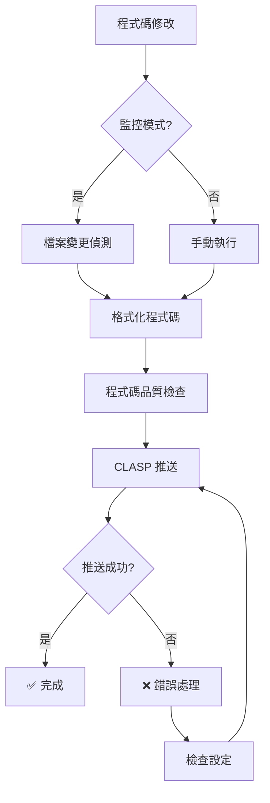

# 自動部署指南 - Google Apps Script

## 🚀 自動推送方式

專案提供多種自動推送到 Google Apps Script 的方式：

### 1. Git Commit 自動推送（推薦）

每次執行 `git commit` 時自動推送：

```bash
# 設定一次即可
npm install
npx husky install

# 之後每次 commit 都會自動推送
git add .
git commit -m "更新功能"
# 🔧 Pre-commit: 格式化程式碼並推送到 Google Apps Script...
# ✅ 程式碼已自動推送到 Google Apps Script
```

### 2. 檔案監控自動推送

監控 `src/` 目錄變更，自動推送：

```bash
# 啟動監控模式
npm run watch

# 或使用腳本
./scripts/auto-push.sh watch
```

當您修改 `src/` 目錄下的任何 `.js` 檔案時，系統會：
1. 自動格式化程式碼
2. 檢查程式碼品質
3. 推送到 Google Apps Script

### 3. 手動執行自動推送

```bash
# 執行格式化 + 品質檢查 + 推送
npm run auto-push

# 或使用腳本
./scripts/auto-push.sh
```

### 4. GitHub Actions 自動部署

每次推送到 GitHub 時自動部署：

1. **設定 GitHub Secrets**：
   - `CLASP_CREDENTIALS`: CLASP 登入憑證
   - `SCRIPT_ID`: Google Apps Script 專案 ID

2. **自動觸發時機**：
   - 推送到 `main` 或 `develop` 分支
   - 建立 Pull Request

## ⚙️ 初始設定

### 1. 安裝 CLASP

```bash
# 安裝 CLASP CLI
npm install -g @google/clasp

# 登入 Google 帳戶
clasp login
```

### 2. 設定專案

```bash
# 建立新專案
clasp create --type standalone --title "Google Classroom Manager Pro"

# 或設定現有專案 ID
echo '{"scriptId":"YOUR_SCRIPT_ID","rootDir":"./src"}' > .clasp.json
```

### 3. 啟用 Git Hooks

```bash
# 安裝依賴
npm install

# 設定 Husky
npx husky install
```

## 📋 命令列參考

### 基本命令

```bash
# 手動推送
npm run push

# 拉取遠端變更
npm run pull

# 格式化 + 檢查 + 推送
npm run auto-push

# 啟動監控模式
npm run watch

# 開發模式（監控 + 推送）
npm run dev:watch
```

### 部署命令

```bash
# 測試部署
npm run deploy:test

# 生產部署
npm run deploy:prod

# 檢查狀態
clasp status

# 開啟編輯器
clasp open
```

## 🔧 設定檔說明

### .clasp.json
```json
{
  "scriptId": "您的 Google Apps Script 專案 ID",
  "rootDir": "./src"
}
```

### nodemon.json
```json
{
  "watch": ["src/"],
  "ext": "js",
  "exec": "npm run auto-push",
  "delay": 2000
}
```

## 🛡️ 安全注意事項

### 保護敏感資訊

1. **不要提交 .clasp.json**（如果包含敏感資訊）：
   ```bash
   echo ".clasp.json" >> .gitignore
   ```

2. **使用環境變數**：
   ```bash
   export SCRIPT_ID="your_script_id"
   ```

3. **GitHub Actions 使用 Secrets**：
   - 設定 Repository Secrets
   - 不要在程式碼中硬編碼憑證

### 權限管理

- 確保 Google Apps Script 專案權限正確
- 定期檢查 OAuth 授權狀態
- 使用最小權限原則

## 🐛 疑難排解

### 常見問題

#### 1. 推送失敗：「未授權」
```bash
# 重新登入
clasp logout
clasp login
```

#### 2. 找不到專案
```bash
# 檢查 .clasp.json 設定
cat .clasp.json

# 確認專案 ID 正確
clasp status
```

#### 3. 權限錯誤
```bash
# 檢查 Google Apps Script 專案設定
clasp open

# 在編輯器中重新授權
```

#### 4. 監控模式無法啟動
```bash
# 安裝 nodemon
npm install nodemon --save-dev

# 檢查 nodemon 設定
cat nodemon.json
```

### 日誌檢查

```bash
# 查看 CLASP 狀態
clasp status

# 查看 Google Apps Script 日誌
clasp logs

# 查看檔案列表
clasp list
```

## 📊 工作流程圖



## 🎯 最佳實踐

1. **開發流程**：
   - 使用監控模式進行開發
   - 定期檢查 Google Apps Script 編輯器
   - 保持程式碼格式化

2. **版本管理**：
   - 使用有意義的 commit 訊息
   - 定期備份 Google Apps Script 專案
   - 使用分支管理功能開發

3. **測試流程**：
   - 在測試環境先驗證功能
   - 使用 `deploy:test` 進行測試部署
   - 確認無誤後執行生產部署

---

設定完成後，您只需要專注於程式碼開發，系統會自動處理部署流程！